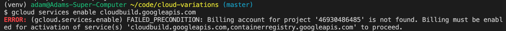
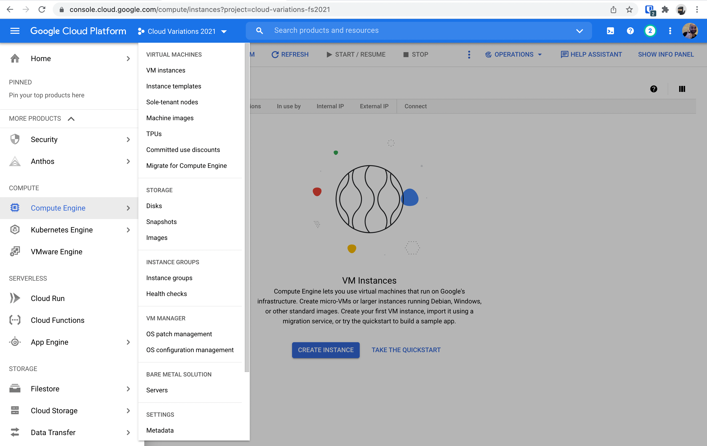
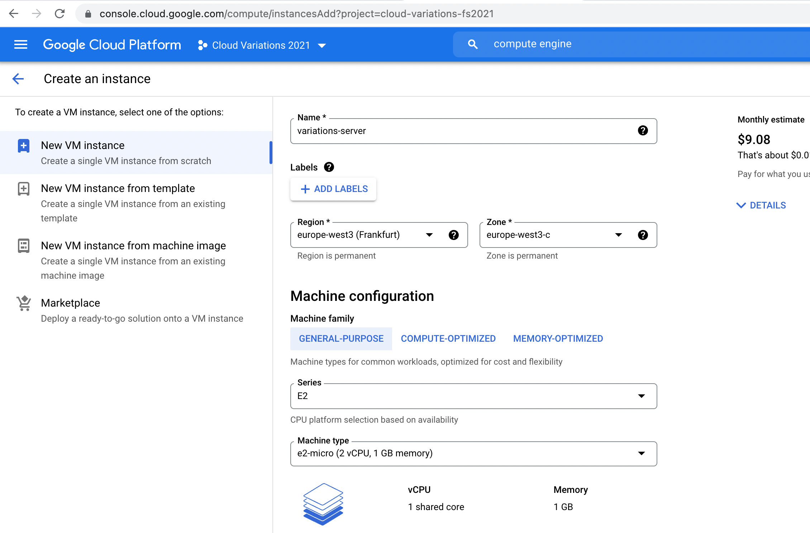
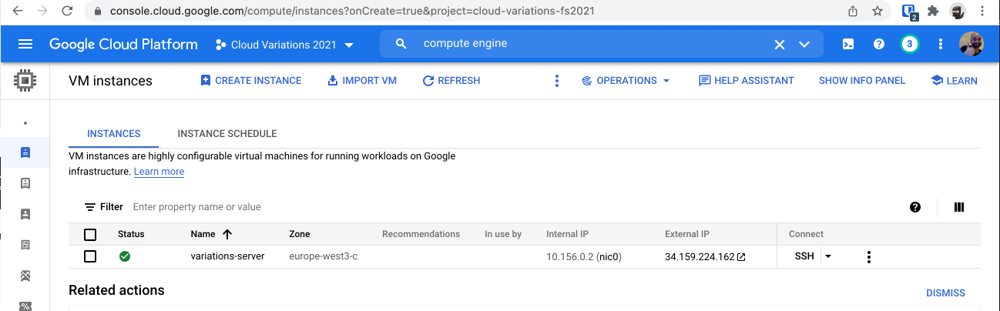

# The Cloud Variations 

This repository represents multiple ways to run a very simple server application on The Cloud. The goal is to get a feeling for different ways of operating (running) this simple application. The app itself is a hello world REST API with a JSON response, written in Python using Flask. The app itself is irrelevant, the ways of running it are the interested part. This repository accompanies a class at CODE University of Applied Sciences, last taught in Autumn 2022. 

Pull Requests are highly welcome, for example for corrections, clarifications, or maintenance. 

## Table Of Contents
1. [The Cloud Variations](#the-cloud-variations)
1. [Local Installation and Operations](#Local-Installation-and-Operations)
1. [Starting on the Cloud](#Starting-on-The-Cloud)
1. [Prelude: Infrastructure-as-a-Service](#Variation-Infrastructure-as-a-Service)
1. [Variation: Functions-as-a-Service](#Variation-Functions-as-a-Service)
1. [Variation: Platform-as-a-Service](#Variation-Platform-as-a-Service)
1. [Intermission: Containerize the Application](#Intermission-Containerize-the-Application)
1. [Variation: Serverless Container Management](#Variation-Serverless-Container-Management)
1. [Variation: Managed Kubernetes Cluster](#Variation-Managed-Kubernetes-Cluster)
1. [Make This Your Own](#make-this-your-own)

## Local Installation and Operations 
The goal of this section is to install and run our little web server locally on your own computer, and get set up with the Google Cloud SDK and Account for the next steps. 

### Pre-Installed Requirements 
Before you get started, you are expected to have some other software on your computer

- Python 3.10 (tested with 3.10.6)
- git 
- [Google Cloud SDK](https://cloud.google.com/sdk/docs/quickstart), (tested with version 398.0.0)
- An integrated development environment, like VS Code. 
- [Docker](https://www.docker.com/products/docker-desktop) for building and running docker images locally

### Install Locally   
- mkdir WORKING_DIR && cd WORKING_DIR, with a directory name of your choice (e.g. cloud2022). 
- git clone this repository locally

- Install a local python virtual environment with python 3.10 to work with, 

    macOS/Linux: `python3.10 -m venv venv` 
    
    Windows: `c:\Python310\python -m venv c:\path\to\myenv`

- Activate your virtual environment for this project: 
   
    macOS/Linux: `source venv/bin/activate`
    
    Windows: `venv\Scripts\activate.bat`

- Install packages: `pip install -r requirements.txt`

- Point Flask to your application: 

    macOS/Linux:  `export FLASK_APP=main.py`
    
    Windows: `set FLASK_APP=main.py`

- run your flask application: 

    `flask run --port=5017`

Once you are running, you should be able to see a JSON response in the browser by navigating to http://localhost:5017 or by using cURL to GET a response, e.g. `curl localhost:5017`. You should now be able to see our message, `{"message": "Hello, Cloud!"}`, served locally.  

### Restarting your Local Development Environment

Note that every time you re-open your local development environment, you will have to navigate to your local directory, activate the virtual environment, and set the FLASK_APP environment variable in order to start flask 
 

## Starting on The Cloud

Now that you have a local version of our highly sophisticated API running, the goal is to deploy it. If you are already familiar with Google Cloud Platform, skip ahead to the deployment part. 

- Make sure you have the [Google Cloud SDK](https://cloud.google.com/sdk/docs/quickstart) installed already. If you have an older version, be sure to [update it](https://cloud.google.com/sdk/gcloud/reference/components/update)

- You will need to [get class credits](https://www.notion.so/codeuniversitywiki/Cloud-Credits-for-Projects-633622b1ff5f4116bd01778b247246d1) at this stage, or use credits you already have. That will enable you to actually deploy stuff. 

- If you have never used Google Cloud Before, you might find it easier to first create an account on the browser and [poke around the dashboard](https://console.cloud.google.com/). We will use both the CLI and the Dashboard in these exercises, but mostly the CLI. 

- If you have trouble with the local setup of the gCloud SDK, it is worth it to note that everything done here can be done in the browser, as well. You can still participate in the class and learn a lot, but the steps are not documented here -- you'll have to find that in the documentation online. 

### Prepare your Google Cloud Account
In GCP, a Project is the top-level organizational element. You can learn more about it [here](https://cloud.google.com/storage/docs/projects) or elsewhere. We will use one project for the following examples, but feel free to create more, for instance, one project per variation, if you would like. The names are entirely up to you; you are encouraged to customize them to your liking. 

Create a project on Google Cloud Platform: 

 `gcloud projects create cloud-variations-fs2022 --name="Cloud Variations"`

You should be able to see this in your dashboard on Google Cloud after a few seconds. Now, we're ready for our first deployment! You can also get information from the CLI using `describe`, e.g. 

`gcloud projects describe cloud-variations-fs2022`

which will show information including status, name, and the projectId, which we will need in the next step. 

Once creating this project, set your local environment to default to using that new project: 

`gcloud config set project cloud-variations-fs2022`

This ensures that it will not conflict with any other projects you may have on GCP.

Before we start deploying, we have to enable the Cloud Build API, which several of the services we will use depend on:

`gcloud services enable cloudbuild.googleapis.com`

Note that this step is a little bit finnicky. If you have errors here, there is likely a problem with the credits or billing. You may have to go into the console and associate the credits you have received with this new project. 

 

The goal is to associate the Education Credits you have received with this project. The easiest way to do this is [on the dashboard in the browser](https://cloud.google.com/billing/docs/how-to/modify-project#to_change_the_projects_account_do_the_following), but it can be done via the CLI as well. 

As of writing, there are [commands in the beta version of the gcloud SDK API](https://cloud.google.com/sdk/gcloud/reference/billing) which allow you to do this from the command line. First, use `gcloud beta billing accounts list` to get the ACCOUNT_ID of the account you want to use; if you are new to gCloud it should be the only account listed. The ID has a format like 0X0X0X-0X0X0X-0X0X0X. Then, link that billing account to your project, e.g. 

`gcloud beta billing projects link cloud-variations-fs2022 --billing-account 0X0X0X-0X0X0X-0X0X0X`

Now you should be able to enable the cloud build API without running into errors: 

`gcloud services enable cloudbuild.googleapis.com`

With that, we are all set up and ready to go! Finally, we can run something on the the cloud. I encourage you to poke around the [cloud console dashboard](https://console.cloud.google.com/) and find the services you have already enabled and the project you have created. 

## Variation: Functions-as-a-Service 

We begin with the most high-level, abstract, hands-of approach to running our service: Functions, also sometime slightly incorrectly called "Serverless" or "Lambda". We need to provide Google Cloud Functions only with the code of a function and some basic options, and it will run it for us. 

Enable the cloud functions service on your project:

`gcloud services enable cloudfunctions.googleapis.com`

And now we will deploy a single _function_ from our application, the function `index()` found in the file `api/hello_cloud.py`: 

`gcloud functions deploy hello_cloud --runtime python310 --trigger-http --allow-unauthenticated --max-instances 2 --set-build-env-vars=GOOGLE_FUNCTION_SOURCE=api/hello_cloud.py --region=europe-west3`

This reads as: "Hey Google, deploy a Cloud Function for me called hello_cloud, which is both the name of the function that I've defined as well as the name that you'll use to identify the function. That function in the file api/hello_cloud.py. It should use the Python 3.10 runtime, anyone can access it on the internet without authentication, but only allow 2 instance to not run up my bill. Run the function if there is an HTTP request to the URL". 

You should be able to now see your function running live on the internet now, at the url listed in the output of the command or in the console. It has a format like https://{Region}-{ProjectID}.cloudfunctions.net/{function-name}, in my case https://europe-west3-cloud-variations-fs2022.cloudfunctions.net/hello_cloud. 

And there we have it: you can run a function on Google's Cloud without any concern for how to manage the server, just setting a few basic parameters.  

## Variation: Infrastructure-as-a-Service 
Next, we jump over to the lowest level approach available on the cloud: we will rent our own (virtual) computer, and set it up from scratch. This is, in a sense, the "old way" of doing things. Apart from buying server racks yourself, this is about as low-level as it usually gets. 

Google Cloud's service for this is called Compute Engine. We will rent a computer from Google, and then do the rest ourselves. We will set this up via the browser-based console in order to get an idea for how to do it, but you of course also do this from the command line. Google Documentation can be found [here](https://cloud.google.com/python/docs/getting-started/getting-started-on-compute-engine), but the instructions below should work with our code and your setup. Hopefully. 

Go to the [Google Cloud Console in the browser](https://console.cloud.google.com/), make sure you are logged in, and the correct project (created above, via the command line) is selected. You should be able to go to the [Functions List page](https://console.cloud.google.com/functions/list) and see the function `hello-cloud` which we have just created. That tells you that you are in the right place, and everything has worked so far. 

Next, go to the Compute Engine page. You can find this either by navigating (as shown below) or by searching for the service in the search bar. You might need to enable the API first. 

 

Once there, click on "Create Instance". This will walk you through the process of renting a computer - or Virtual Machine - from Google Cloud. Some of the default settings are OK, others should be changed. 

In particular: 
 
 * Set the Region to `europe-west3` (Frankfurt)
 * Set the Machine Type to `e2-micro` (2 CPUs, 1GB RAM
 * Make sure the Boot Disk is set to `Debian 11` (Bullseye)
 * Set the Firewall to "Allow HTTP Traffic" 
 
Then click "Create" at the bottom of the page.

  Virtual Machine Settings on Google Compute Engine

Once this has been created, you should see an overview of your VM Instances (the computers you have rented). Congratulations! You have rented a computer from Google.  

  VM Instances.

Now, we want to set this up to run our software. The next step is to SSH into your server. There are many ways to do this. Click on the "SSH" button to see options. "Open in Browser Window" will open a new browser window running a virtual terminal, giving you command-line access to your server. This is a fancy option which Google Cloud offers, and I would recommend trying it. You can also open this from your local command line (click on `view glcoud command` to see what you would type into your local terminal), or of course good old fashioned `ssh` from your local computer. Once in, poke around your computer a bit. The command `python3 --version` will show you that a version of Python is installed (I see 3.9.2, which is not the right version for us), and `which git` will return empty, showing that git is not installed. 

Let's start by making sure everything we already have installed on our computer is up to date: 

> sudo apt update && sudo apt upgrade 

 installing git and well as venv: 

> sudo apt-get install git python3-venv
 
and then cloning this very repository to your new server: 

> git clone https://github.com/DrAdamRoe/cloud-variations.git

At this stage, you should be able to setup and run python using the same commands as you did locally (using the Linux/macOS instructions above): create a virtual environment, activate it, install requirements, and set FLASK_APP environment variable.

Now, you should be able to run your app. Expose it on port 5017:

> flask run --port=5017

Your flask app is now running on a computer in the cloud, but it is not accessible on the internet yet. The port we are running on, 5017, is not a standard port. Use ctrl+c to kill the process. 

What we will do next is set up our environment to run a web server on the public internet. So far, we have a Debian Linux operating system running on Google Cloud's infrastructure, and we have our code on it. A combination of steps is necessary to run our server. You may have noticed the big red warning saying "do not do this in production, use WSGI instead.". That is what we'll do. To do this, we have to install a few more things:

First, we need some system-wide build tools: 
> sudo apt-get install build-essential python3-dev 

Then, we can install a production-ready Python server, uWSGI. This is a best-practice, and it is enforced by the security practices on the infrastructure we have rented and set up so far. 

> pip install --version uWSGI==2.0.20

Now, you should be able to run the following command:
> uwsgi --socket 127.0.0.1:5017 --wsgi-file main.py --callable app

The output to terminal looks different, but you should now be running your Flask app on your server on port 5017, once again. Go to your virtual machine's public internet address in the browser, visible on the VM Instances overview page on the Google Cloud Console. Mine is http://34.159.224.162/. You won't see your API, unfortunately, but you will see "This page isn't working": your server isn't yet responding. Since HTTP uses port 80 as a standard, both our browser and Google's network settings expect us to be requesting from and listening on port 80, not 5017. To remedy this, we'll use a webserver called nginx. Kill the process in your terminal again (ctrl+c). We're almost there. 

Install nginx: 
> sudo apt-get install nginx 

We'll have to use the sudo command in front of everything we will do here to configure nginx. Once installed, the server should be running automatically.

If you navigate to your computer's IP address in the browser, you should now be served the nginx default page. Now "all" we need to do is have nginx serve a response from our Flask app instead of it's default static HTML page. This repository contains a file, nginx.conf, which is a configuration file for nginx. 

Copy the config file into the folder where nginx looks for configs: 

> sudo cp nginx.conf /etc/nginx/sites-available/cloudvariations

Then link that configuration from the sites-enabled folder: 

> sudo ln -s /etc/nginx/sites-available/cloudvariations /etc/nginx/sites-enabled/cloudvariations

Now we have to remove the default configuration which nginx shipped with: 

> sudo unlink /etc/nginx/sites-available/default
> sudo rm /etc/nginx/sites-enabled/default 

and we should be in good shape. 

Test the configuration using: 
> sudo nginx -t 

This will catch syntax errors and some other consistency issues. If it is OK and successful, we can now finally restart nginx, which will reload the configuration files: 

> sudo systemctl restart nginx

If you now navigate to your website's public IP address (found on the cloud console next to that VM), you should see an error served by nginx: "502 Bad Gateway". This is actually a good sign: it means that your rented computer is forwarding HTTP requests on port 80 to nginx, which is trying to respond with whatever application is running internally. Since nothing is running right now, there's an error. 

As a final step, we have to start our Flask application again, using the same command as above: 

> uwsgi --socket 127.0.0.1:5017 --wsgi-file main.py --callable app

There you have it: you have rented a virtual machine from Google Cloud and set up your Flask server by hand. You have enormous control using this method, but that was a few more steps than the previous approach. For this service to be usable in production, you would need to do two additional steps (at a minimum). While the webserver nginx is now set up to always be running, the Flask application is running via the terminal right now. If your connection closes, if you shut off your home computer, the process will stop on the rented server. You would need to make this run automatically. Additionally, you would need to encrypt the connection, using HTTPS instead of HTTP. There are excellent instructions for how to do this [here](https://www.digitalocean.com/community/tutorials/how-to-serve-flask-applications-with-uwsgi-and-nginx-on-ubuntu-20-04), using a slightly different set up - but it should be close enough for you to make that work, if you would like to. 

## Variation: Platform-as-a-Service

In this variation, we will use Google's Platform-as-Service offering, Google App Engine. Our entire Flask app will be built, run, and managed by Google Cloud with minimal configuration on our side. We specify the Python runtime, the size of the target server, and some routing rules, and Google Cloud handles the rest (including things like installing the packages listed in our `requirements.txt` file). 

Create an instance of an App, either from the CLI or through the dashboard. Be sure to get the projectId from the previous step: 

`gcloud app create --project=cloud-variations-fs2022 --region=europe-west3`

again, you can check it's status at the CLI or the dashboard: 

`gcloud app describe --project=cloud-variations-fs2022`

Note that at this stage, you have created an "application", but there is nothing being served yet. You will automatically have a custom URL for this project, which has the format PROJECT_ID.appspot.com, in my case https://cloud-variations-fs2022.appspot.com. If you navigate to your own URL, you will get a 404: there is nothing being served there yet. 

Now, we can deploy our app! The application configuration is entirely described in a single file, called `app-engine.yaml`. To deploy, we will tell app engine to use the configuration we have detailed in that file: 

`gcloud app deploy app-engine.yaml`

And there we have it: your app is deployed! Look at that yaml file and see what we need to describe the infrastructure: a runtime (Python version), an instance class (the size of the VM we will us, in this case, [F1](https://cloud.google.com/appengine/docs/standard), with 256 MB of RAM), and some routing rules - similar to what we would need to define for a web server application like nginx, Caddy, or Apache. This tells app engine to respond to any request with the response of our application (as opposed to a redirect request, serving a static file, or an error, for instance. In this variation, we are able to specify resources (like the compute instance size), but still are not concerned with things like the underlying operating system. 

## Intermission: Containerize the Application

In order to prepare for the next variations of running our app, we will first build the container ourselves (using Docker) and push it to Google Cloud's container registry, allowing us to use that container on various managed services. 

### Build and Run the container locally 

To start, build a Docker image, based on the Dockerfile provided for you in this repository: 

`docker build --tag hello-cloud .`

and run it locally: 

`docker run --publish 5017:5022 hello-cloud`

At this point, you should be able to again make a request locally, via `curl localhost:5017` or by going to the browser. 

At this stage it is worth it to have a look at our Dockerfile, even if you aren't very familiar with Docker. We first define which base image we are using - in this case, an imagine provided by the Python Organization built on top of Debian 11 (codename bullseye). This gives us an operating system and everything we need to run Python 3.10. Then, we copy files from our local development environment into Docker's working area, and after that, we do the same thing as we do locally without Docker: install packages, set an environment variable, and run the app. Just this time, it is running as a Docker container on our own computer. 

### Push the Image to Google Cloud 

In this step, we will push our image to Google Artifact Registry -- a dedicated type of storage which we will configure to store Docker images (similar to Docker Hub, if you are familiar with it). 

Start by Enabling the Artifact Registry:

`gcloud services enable artifactregistry.googleapis.com`

Now, we'll push your Docker Image to Google's Artifact Repository. To do this, we will use the tool provided by gCloud to authorize yourself on Docker on your machine giving you permissions to push to your Google Cloud Artifact Registry: 

`gcloud auth configure-docker europe-west3-docker.pkg.dev`

Next, create a repository in the Artifact Registry for you to store your image in: 

`gcloud artifacts repositories create hello-cloud --repository-format=docker --location=europe-west3`

Note that the format "Docker" specifies that what type of artifact the repository should expect, a Docker Image. 

Now you can tag your local image to push to a specific location, telling Docker where you will push it: to the repository you just created. You should replace `cloud-variations-fs2022` with your project name: 

`docker tag hello-cloud:latest europe-west3-docker.pkg.dev/cloud-variations-fs2022/hello-cloud/hello-cloud:latest`

And finally, push it to Google's Artifact Repository: 

`docker push europe-west3-docker.pkg.dev/cloud-variations-fs2022/hello-cloud/hello-cloud:latest`

Phew. We've built a Docker image locally and pushed it to Google Cloud. You can see the fruits of your labors (and browse the directory structure) over on the dashboard at https://console.cloud.google.com/gcr/images/{your-project-name}. 

## Variation: Serverless Container Management 

Sometimes cloud services feels like they were generated by putting random buzzwords together, and Cloud Run is no exception. In this variation, we will run our custom-built container on a platform managed by our cloud provider. We can will use a service which conforms to the [knative](https://knative.dev/) standard, giving us more flexibility than a Functions-as-a-Service offering but without the need to provision an entire Kubernetes cluster. This is considered "serverless" because you don't need to manage any servers, even if it is not a "Function-as-a-Service" offering. 

First, enable the Google Cloud Run API: 

`gcloud services enable run.googleapis.com`

Then, we will create and deploy our new _service_, which will tell Cloud Run to run between 2 and 5 instances of our container based on the image we have built and pushed already. 

`gcloud run deploy hello-cloud-run --image=europe-west3-docker.pkg.dev/cloud-variations-fs2022/hello-cloud/hello-cloud:latest --port=5022 --region=europe-west3 --allow-unauthenticated --min-instances=2 --max-instances=5`

This command should feel a bit like the one we used for the FaaS offering at the start, but with a bit more control. If your container runs locally but not on google cloud, you may need to change the build architecture. Have a look at the troubleshooting section below. 

Go over to the [dashboard](https://console.cloud.google.com/run/) and poke around a bit to see what you have running there.

Once you are done, remember to cleanup by deleting the service -- otherwise it could suck up all your credits: 

`gcloud run services delete hello-cloud-run`

## Variation: Managed Kubernetes Cluster

We've already run some high-level managed versions of our API, and now we are going to take things a bit more into our own hands, running our service in Kubernetes. We will use Google Kubernetes Engine, Google's managed Kubernetes cluster, so we only have to _use_ Kubernetes, not host it ourselves. 

! Note that this may get a little bit tricky on your local machine. If you have trouble with further installation and configuration, you access the [gCloud Shell](https://cloud.google.com/shell) through your browser, giving you a command line interface allowing you to interact with your project. 

### Additional Software 

- [Install kubectl](https://kubernetes.io/docs/tasks/tools/), the command line interface for interacting with Kubernetes itself. 

### Run our container using Kubernetes
Now it's time to run our Docker container on our own Kubernetes Cluster. 

Enable the Google Kubernetes Engine API: 

`gcloud services enable container.googleapis.com`

Now we can create a Kubernetes cluster: 

`gcloud container clusters create hello-cloud-cluster --num-nodes=1`

You may crash out with an error that says _Please specify location_. Let's set it to Frankfurt: 

`gcloud config set compute/zone europe-west3-b`

and try again to create the cluster with the above command. Now you should get a few yellow warnings, but no red errors. 

And now we are ready to interact with our Kubernetes cluster!

Use the gcloud-provided tool to configure your kubectl on your machine for interacting with your cluster on gcloud: 

`gcloud container clusters get-credentials hello-cloud-cluster`

Now, try to find out a bit about your cluster using `kubectl describe`, for example `kubectl describe nodes`, which will show a whole lot of hard to understand information about your kubernetes cluster. 

Create a _deployment_ based on our Docker image, effectively declaring that we want our Docker image to run in Kubernetes:

`kubectl create deployment hello-cloud-server --image=europe-west3-docker.pkg.dev/cloud-variations-fs2022/hello-cloud/hello-cloud:latest`

Once you have run this, it is running already, but we have to expose it on the network to see it, mapping our local port 5022 to the public port 80 for HTTP: 

`kubectl expose deployment hello-cloud-server --type LoadBalancer --port 80 --target-port 5022`

You can now find the public (external) IP address of your application using: 

`kubectl get service hello-cloud-server`

In my case, I see 34.107.66.217, which I can now access in the browser at http://34.107.66.217 or locally via curl again, `curl 34.107.66.217`. Note that by provisioning your own kubernetes cluster, you do not have an automatically assigned domain -- and therefore also no encryption on the connection.  

That's "it"! Your very own Docker container running on your very own Kubernetes Cluster. 

Before you leave: shut off your Kube cluster, otherwise you'll run out of money, shutting off the load balancer and then your cluster: 

`kubectl delete service hello-cloud-server`

`gcloud container clusters delete hello-cloud-cluster`

## Cleanup! 

That's "it". Before leaving, cleanup your account, otherwise it will suck all of your credits dry. We've all been there. If you are completely done, you can "shut down" the project entirely, and everything will be deleted soon. Alternatively, you can keep the FaaS or PaaS service running for a few cents or euros a month. It is highly recommendable to shut off the kubernetes (GKE) instances once you are finished with the tutorial. They get pricey quickly. 

## Make This Your Own

Now that you have run through four variations, you are encouraged to make this your own. Here are a few ideas for continuing to explore cloud models for operations: 

- Change what the app itself does. You can edit the message, or add a route. 

- Consider other ways of running this application on the cloud. For instance, use GCP's virtual machine's directly (Compute Engine) and consider hosting your application directly, running on the machine itself. What do you have to configure yourself, and what are the differences to the managed services we have used here? 

- Run through this again with a programming language of your choice, again creating a hello world application and deploying it many ways. 

- Add a second simple application. It could be a frontend which consumes this backend api (representing a standard web app setup with a frontend and a backend), a separate stand-alone server application with another route (representing a microservice-like architecture), or an internal-facing api which is not exposed on the public internet but which our existing app can call to (representing an n-tier architecture). Consider how you would deploy both of these applications, either together or separately, and configure them to have different resources and uptimes. 

- Use a managed API service, for example for translation or natural language processing on our highly sophisticated message. How does this service differ from ones which we are defining ourselves? What would it take for you to create an API like this yourself, even if you had the model accessible? 

- Add a database layer using a managed service. You can put the message we are returning into that database. What do you have to consider to connect this application to the database, with each of these methods? What database services are available, and which are appropriate for this application? 

## Troubleshooting 

Weird problems can occur. Here are a few we've seen so far, and possibly ways to remedy them. 

### Too Many Versions 
If you see an error like this, you need to delete old (unused) versions of your app. 

> ERROR: (gcloud.app.deploy) INVALID_ARGUMENT: Your app may not have more than 15 versions. Please delete one of the existing versions before trying to create a new version

You can do this by clicking through the gCloud Console and manually deleting them. Or, you can use a fancy command like this: 

``gcloud app versions delete `gcloud app versions list --filter="traffic_split=0" --format="table(version.id)"` ``

This monstrous command is really two in one. The inner command, within backticks (`` ` ``), is executed first. This will list all versions of the app which have no traffic flowing to them (hence the `--filter`), but will only list the versions id and no other information (hence the `--format`). This list will be parsed, line by line, by the outer command, which will try to delete those app versions. 

### Wrong Build Architecture for GCP

If you can't deploy your container to Google Cloud Run, you might see an error like this: 

>ERROR: (gcloud.run.deploy) Cloud Run error: Container failed to start. Failed to start and then listen on the port defined by the PORT environment variable. Logs for this revision might contain more information. 

and upon looking at the logs, you may see something like: 

> terminated: Application failed to start: Failed to create init process: failed to load /usr/local/bin/flask: exec format error 

The issue is probably that your own computer's processor uses a different architecture than the one on Google Cloud, in particular if you are using a newer Mac using an ARM architecture (M1). To resolve this, you'll have to build an image for a different architecture than on your computer. The process is documented [here](https://docs.docker.com/desktop/multi-arch/). 

Once you have followed the instructions there, the following build command should give you an image which you can use both locally and on Google Cloud: 

> docker buildx build --platform linux/amd64 --tag hello-cloud . --load

and then you can continue as above, with `docker run`, `docker tag`, `docker push`, and finally `gcloud run deploy`. Note that the local performance will be degraded with this setup, but that should be fine for this hello-world app. There are more sophisticated approaches for building for multiple architectures. 

